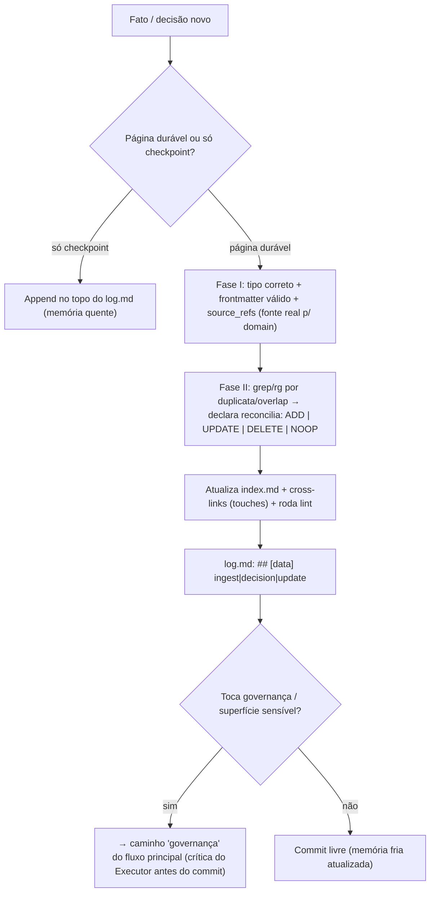

Fluxograma end-to-end do Engrama: ciclo de vida da sessão e da fatia, com **todos os caminhos** (código · governança · computer-use), o gate de crítica mecânico, o escalonamento à Autoridade, e o ciclo PR/CI/merge/release. É **visualização** dos normativos — a fonte da verdade continua sendo [[memory/governance/cadeia-de-comando]], [[memory/governance/modelo-operacional]] e [[memory/governance/continuidade-de-sessao]]; em divergência, prevalece o normativo, não este diagrama.

## Fluxo principal — sessão + fatia

Render: [`assets/engrama-fluxo.png`](assets/engrama-fluxo.png) · fonte: [`assets/engrama-fluxo.mmd`](assets/engrama-fluxo.mmd)

```mermaid
flowchart TD
    Start(["Sessão abre"]) --> GateRead["Lê o gate na ordem: governança/index → papéis → cadeia → modelo → continuidade → bootstrap → topo do log.md"]
    GateRead --> Handshake["Handshake obrigatório: papel · alçada · estado factual · próximo passo seguro · o que depende da Autoridade"]
    Handshake --> BootChk{"bootstrap-do-projeto 'proposed' ou com TODO?"}
    BootChk -->|"sim"| Wizard["WIZARD de bootstrap: Orquestrador entrevista a Autoridade (finalidade · stack · comandos · superfícies sensíveis · fronteiras) → ajusta classify() → loga"]
    BootChk -->|"não"| Slice
    Wizard --> Slice["Define a MENOR fatia (início e fim verificáveis)"]
    Slice --> Coer{"Coerente com .engrama / ADRs?"}
    Coer -->|"contradição"| Resolve["Resolver explicitamente (ADR / gap)"]
    Resolve --> Slice
    Coer -->|"ok"| Branch["Orquestrador abre a branch da fatia"]
    Branch --> Tipo{"Natureza da fatia"}

    Tipo -->|"código"| Order["Orquestrador monta a ORDEM mínima (10 itens) + roteia tier/modelo e invoca codex exec (executor-bridge)"]
    Order --> Avail{"Executor disponível?"}
    Avail -->|"não"| BG["código AGUARDA (default seguro)"]
    BG -.->|"break-glass: ordem explícita da Autoridade — escopo mínimo + log + revisão retroativa do Executor"| Write
    Avail -->|"sim"| ECrit["Executor CRITICA a ordem ANTES de executar (riscos, lacunas, pré-condições)"]
    ECrit --> EVerd{"Veredito do Executor"}
    EVerd -->|"concordo / ajuste-menor (assume)"| Write["Executor ESCREVE o código + evidências (Orquestrador NUNCA escreve fatia)"]
    EVerd -->|"discordo — material (4 gatilhos)"| Escala
    Write --> Audit["Orquestrador AUDITA (QA): re-roda build/lint/test — verde reportado ≠ verde verificado"]
    Audit --> AuditR{"Estado real = objetivo?"}
    AuditR -->|"reprovado"| Order
    AuditR -->|"aprovado"| Engrama

    Tipo -->|"computer-use (UI mutante)"| CU1["Fase 1: reconhecimento read-only (Executor)"]
    CU1 --> CUap["Orquestrador aprova approved_action_scope (alvo/estado/permitido/proibido/parada)"]
    CUap --> CU2["Fase 2: executa o exatamente-aprovado (para se a UI divergir)"]
    CU2 --> Audit

    Tipo -->|"governança"| Gauth["Orquestrador AUTORA (ADR / spec / governance)"]
    Gauth --> Gcrit["Invoca crítica do Executor (read-only) — ADR 0006"]
    Gcrit --> Gverd{"Crítica"}
    Gverd -->|"consenso / ressalvas incorporadas"| Engrama
    Gverd -->|"impasse / discordo"| Escala

    Engrama["Atualiza o engrama (log / ADR / gap) ANTES do commit"] --> Classify{"classify(): toca superfície sensível? (governance · gate · contract + domínio)"}
    Classify -->|"não"| Commit
    Classify -->|"sim"| Bind{"Ledger tem crítica CONCLUÍDA p/ branch+categoria vinculada ao sha256 do diff (exclui o ledger)?"}
    Bind -->|"falta / hash obsoleto / objeção sem waiver"| Block["critique-gate BLOQUEIA o commit"]
    Block --> Rebind["Executor critica o diff ATUAL (read-only) → registra no ledger com sha256 + codex-session"]
    Rebind --> Bind
    Bind -->|"strong match"| Commit["Orquestrador COMMITA (materializa: auditei e aceito)"]

    Escala["Orquestrador apresenta o conflito FIEL à Autoridade (sem overrule)"] --> Arb{"Autoridade arbitra"}
    Arb -->|"waiver — 2ª confirmação reconhecendo o gatilho (sempre logado)"| Engrama
    Arb -->|"reformular a fatia"| Slice
    Arb -->|"mesmo conflito após 2 rodadas (anti-loop)"| Bloq["Bloqueio formal em memory/gaps/"]
    Bloq --> Close

    Commit --> PR["Push → abre PR"]
    PR --> CI{"CI: test ubuntu+macos · markdown · gitleaks + critique-gate-ci (strict, range origin/main...HEAD) + release-gate"}
    CI -->|"vermelho"| FixCI["Corrige / re-bind do diff agregado"]
    FixCI --> Commit
    CI -->|"verde"| Merge{"Merge na main = alçada da Autoridade (branch protection, enforce_admins)"}
    Merge -->|"aprovado"| Main["main atualizada"]
    Merge -.->|"produção — quando houver deploy"| Prod["PRODUÇÃO intocável (ADR 0009): ordem + 2ª confirmação (AA); Orquestrador nunca aprova MR de prod"]
    Main --> RelChk{"É release?"}
    RelChk -->|"sim"| Tag["bump VERSION + CHANGELOG + tag vX.Y.Z (Autoridade)"]
    RelChk -->|"não"| Close
    Tag --> Close

    Close["Encerramento: engrama atualizado · git declarado · pacote de handoff (15 itens) · checkpoint vivo no topo do log.md"] --> End(["Sessão encerra / handoff"])
```

## Zoom — ingestão de memória em duas fases

Render: [`assets/engrama-ingest.png`](assets/engrama-ingest.png) · fonte: [`assets/engrama-ingest.mmd`](assets/engrama-ingest.mmd). Detalhe normativo em [[memory/specs/ingestao-memoria-dois-fases]] + [[memory/decisions/0012-reconciliacao-de-memoria]].

## Legenda

- **Decisão** (losango) · **ação de papel** (Orquestrador/Executor) · **gate/bloqueio mecânico** · **commit** · **Autoridade / bootstrap / início-fim**.
- Invariantes codificados: tríade por função ([[memory/governance/papeis-e-alcadas]]); sem caminho de código sem Executor; **sem overrule** sobre objeção material (4 gatilhos — [[memory/decisions/0004-executor-critica-ativa-discordancia-escala-a-autoridade]]); governança não se autoaprova ([[memory/decisions/0006-governanca-nao-se-autoaprova]]); diff-binding por `sha256` ([[memory/decisions/0011-diff-binding-atestacao-verificavel]]); produção intocável inativa até deploy ([[memory/decisions/0009-producao-intocavel-dupla-confirmacao]]).

## Caminho de exceção — break-glass (desenhado no fluxo)

Sem Executor disponível, código *aguarda* (default seguro); só prossegue sob **ordem explícita da Autoridade** (escopo mínimo + log + revisão retroativa do Executor) — nó `break-glass` no caminho de código do fluxo principal. Ver [[memory/governance/modelo-operacional]], princípio 2.
